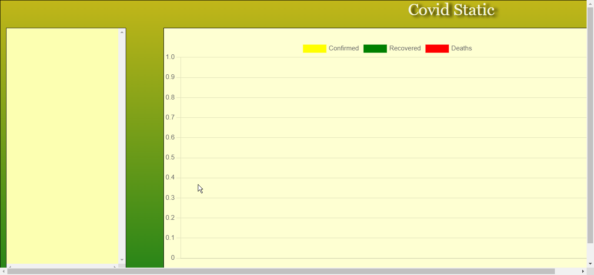

# 🦠 COVID19 Data Visualization

A simple web application that displays COVID-19 statistics for different countries using the COVID-19 API. The application allows users to select a country and view its confirmed, recovered, and death cases over time in a line chart.

## 📄 Project Structure

```
covid19-data-visualization/
│
├── index.html
├── script.js
├── style.css
├── screenshots/
│   └── example_chart.png
└── README.md
```


## 🚀 Features

- **Dynamic Chart:** Visualize COVID-19 data dynamically using Chart.js.
- **Country Selection:** Select a country from the list to view its historical COVID-19 data.
- **Responsive Design:** The application is designed to work well on various screen sizes.

## 🖼️ Screenshots



## 🛠️ Usage

1. Clone the repository:

    ```bash
    git clone https://github.com/Mededdahby/Covid-statics-chart.git
    ```

2. Open the `index.html` file in a web browser.

3. Select a country from the list to view its COVID-19 data in the chart.

## 📝 Additional Information

- The data is fetched from the [COVID-19 API](https://covid19api.com/).
- Feel free to customize the styles in the `style.css` file to match your design preferences.
- Contributions are welcome! If you have any suggestions or would like to improve the project, please open an issue or create a pull request.

## 📝 Additional Information

- Feel free to customize the styles in the `style.css` file to match your design preferences.
- Contributions are welcome! If you have any suggestions or would like to improve the project, please open an issue or create a pull request.

## ⚠️ Notice

**Important:** The COVID-19 API, from which this application fetches data, has been discontinued. As a result, the application may not provide real-time COVID-19 data. Consider exploring alternative APIs for up-to-date information.

```
## 📄 License

This project is licensed under the [MIT License](LICENSE).
```
